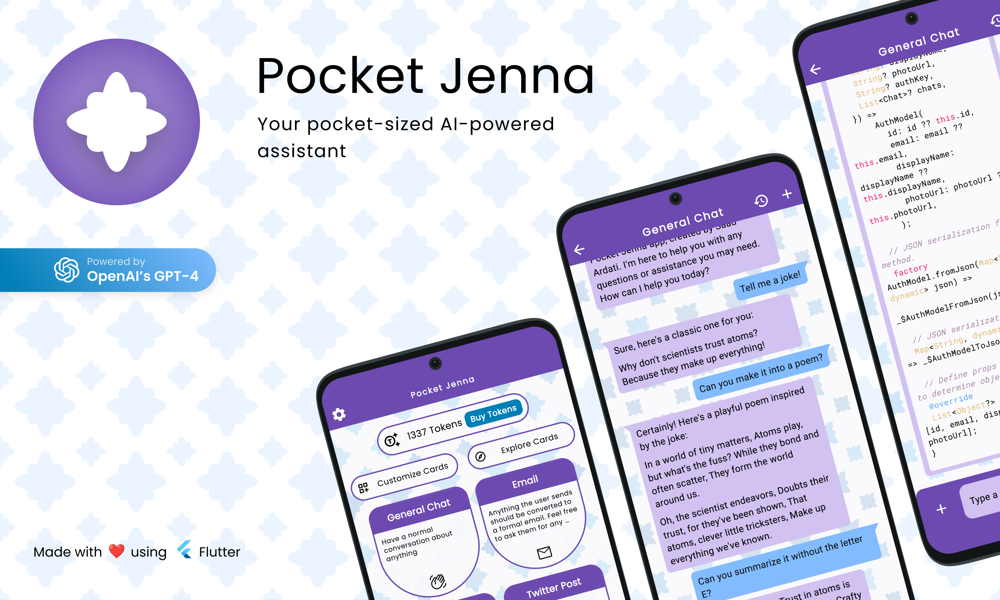

<!---- DOWNLOAD LINKS START --->

| Platform | Available on Stores                                                                                                                             | Direct Download                                                                                                                                                      |
|----------|-------------------------------------------------------------------------------------------------------------------------------------------------|----------------------------------------------------------------------------------------------------------------------------------------------------------------------|
| Android  |  |  |
| iOS      |                    | ❌ &nbsp; Not Available                                                                                                                                               |
| macOS    |                    |      |
| Windows  | ❌ &nbsp; Not Available                                                                                                                          |  |
| Linux    | ❌ &nbsp; Not Available                                                                                                                          | ❌ &nbsp; Not Available                                                                                                                                               |

<!---- DOWNLOAD LINKS END --->

Website: https://hyperdesigned.dev/pocket-jenna

Web App: https://pocket-jenna.hyperdesigned.dev

# Features

- Preset cards that quickly orient GPT to specific tasks for quick and easy use.
- Window is very flexible and can be configured to exist however you like on your system, including the system tray!
- Natural and accessible UI that is easy to use and understand.
- Works on all major platforms: Windows, MacOS, Android, iOS, and web!

## Supported Platforms

| Android | iOS | macOS | Windows | Linux | Web |
|---------|-----|-------|---------|-------|-----|
| ✅       | ✅   | ✅     | ✅       | 🚧    | ✅   |

### Disclaimer

> This is not a product of OpenAI. This is a utility app that uses OpenAI's services.

## Build from source

1. Clone the repo
2. Install dependencies with `flutter pub get` or `derry deps`. They are identical.
3. Run app with `flutter run` on supported platforms.

## Socials

<a href="https://saad-ardati.dev" >  [saad-ardati.dev](https://saad-ardati.dev) </a>

<a href="https://discord.gg/yrahEhCqTJ" >  [discord.gg/yrahEhCqTJ](https://discord.gg/yrahEhCqTJ) </a>

<a href="https://www.linkedin.com/in/saad-ardati/" >  [linkedin.com/in/saad-ardati/](https://www.linkedin.com/in/saad-ardati/) </a>

<a href="https://twitter.com/SaadArdati" >  [twitter.com/SaadArdati](https://twitter.com/SaadArdati) </a>

<a href="https://instagram.com/saad_ardati" >  [instagram.com/saad_ardati](https://instagram.com/saad_ardati) </a>

## Contributors

Thank you [Birju Vachhani](https://birju.dev/) for being a key contributor to this project!

## Contribution

You are most welcome to contribute to this project!

[web]: https://saad-ardati.dev/pocketjenna
